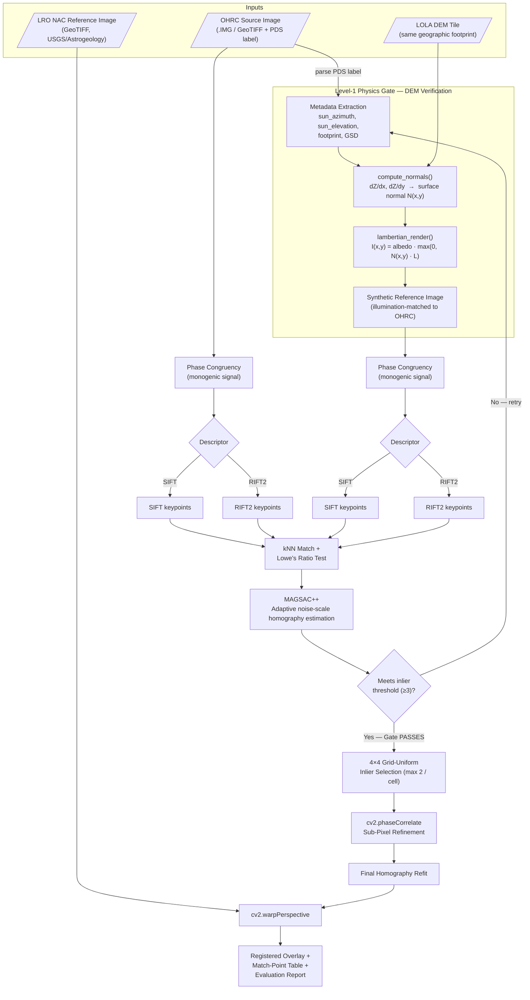

# DEM-Verified Lunar Image Correspondence

### Sun-Angle & Scale Invariant Registration of Chandrayaan-2 OHRC Imagery Against LRO NAC Reference Data

**Smart India Hackathon 2026 — Problem Statement ID 26166**
*"Multi-modal, Sun angle and scale invariant image correspondence using Chandrayaan-2 optical images (OHRC, TMC and IIRS)"*
Organisation: Indian Space Research Organisation (ISRO), Department of Space | Category: Software | Theme: Space Technology
**Team:** GradientZero

---

## 📦 Dataset Note — Read Before Running

The OHRC source images and LRO NAC reference images used in this project are **high-resolution TIFF/PDS files** and are too large to include directly in this repository. All source and reference imagery used to produce the results below has been zipped and uploaded separately.

**Drive link:** [Download Dataset Archive](https://drive.google.com/file/d/1phHVbW06AWaiMw1vAN8WkYKTnZknLfuK/view?usp=drive_link)

Unzip the archive into `data/source/` (OHRC) and `data/reference/` (LRO NAC) before running the pipeline — the paths expected by `run_benchmark.py` assume this layout.

---

## 1. Overview

Lunar image registration is hard for one core reason: the Moon has no atmosphere to scatter light, so almost every strong visual feature on its surface — every crater rim, every ridge — is a **shadow**, not a stable material boundary. Shadows are a direct function of sun azimuth and elevation. When the sun angle differs between the source and reference image, shadows can fall on opposite sides of the same crater (**relief inversion**), which breaks conventional gradient-based feature detectors (SIFT, ORB, SURF) outright.

This pipeline does not attempt to make a single detector immune to that. Instead, it does two things in sequence:

1. **Removes the illumination mismatch physically**, using a 3D Digital Elevation Model (DEM) and a reflectance model to compute — not guess — what the reference terrain should look like under the source image's exact sun position. This computation also acts as a **Level-1 physics-based verification gate**: if the source image's terrain geometry can't be validated against the DEM with sufficient inlier support, the pipeline does not proceed to fine matching.
2. **Removes whatever illumination mismatch is left over structurally**, by matching on a Phase Congruency representation (a structural "edge skeleton" derived from local phase alignment) rather than raw brightness, before handing the result to a descriptor (SIFT or RIFT2).

The result is a pipeline that is claimed to work across a genuinely wide range of sun angles — including grazing, near-extreme illumination — without ever needing paired, illumination-matched training data.

---

## 2. Full Architecture



### Stage-by-stage summary

| Stage | What happens | Why it's there |
|---|---|---|
| Metadata extraction | Sun azimuth, sun elevation, footprint and GSD read directly from the OHRC PDS label | This is the "ground truth" lighting condition everything downstream is built around |
| DEM normal computation | Central-difference gradients over the LOLA DEM grid, converted to a per-pixel surface normal field | Encodes *how the terrain is shaped*, independent of lighting |
| Lambertian render | `I = albedo · max(0, N·L)`, where `L` is the sun direction from the source label | Produces a synthetic image of the reference terrain lit exactly as the real OHRC scene was lit — this is the Level-1 physics gate |
| Phase Congruency | Both the real OHRC image and the synthetic render are converted from brightness to a phase-alignment "structural skeleton" via the monogenic signal | Removes sensitivity to *which side* is bright — edges survive contrast inversion |
| SIFT / RIFT2 | Both descriptors are benchmarked on the same Phase Congruency maps | SIFT is the mature, fast baseline; RIFT2 is purpose-built for radiation/illumination-variant matching |
| Ratio test | Lowe's ratio test on kNN candidate matches | Removes ambiguous matches before geometric fitting |
| MAGSAC++ | Robust homography estimation with an adaptive, marginalized inlier threshold | Filters matches that are not globally geometrically consistent |
| Grid-uniform selection | 4×4 grid, max 2 matches per cell | Guarantees correspondences are spread across the whole scene, not clustered in high-contrast crater fields |
| Sub-pixel refinement | `cv2.phaseCorrelate` on a patch around each surviving inlier | Feature detection alone tops out around 0.5–1 px; this pushes accuracy below one pixel |
| Final warp | Homography refit on refined points, applied via `cv2.warpPerspective` | Produces the registered overlay against the real LRO NAC reference |

---

## 3. Dataset & Metadata

The pipeline cross-registers imagery across genuinely different lunar datasets:

- **Source — Chandrayaan-2 OHRC.** The high-resolution optical source image. `sun_azimuth` and `sun_elevation` are read directly from its raw PDS label — this metadata is the bedrock of the Level-1 gate, since it defines the exact lighting condition the DEM render needs to reproduce.
- **DEM — LRO LOLA.** A 3D topographical grid covering the exact same geographic footprint as the OHRC image. Surface normals (`dZ/dx`, `dZ/dy`) are computed at every pixel and combined with the OHRC sun angles to cast a synthetic Lambertian render of the terrain.
- **Reference — LRO NAC.** High-resolution optical reference strips (USGS/Astrogeology basemap). These are the actual target the OHRC image is aligned against, and are what the 5 test cases below vary across.

---

## 4. Test Cases

Five curated test cases (**TC-00 to TC-04**) were used to evaluate the pipeline. The OHRC source and its geographic footprint are held identical across all five; only the LRO NAC reference image changes, introducing progressively harder shadow and lighting disparities (relief inversion):

| Test Case | Condition | What it stresses |
|---|---|---|
| **TC-00** | Baseline — similar lighting | Easiest case; NAC reference sun angle closely matches OHRC. Shadows fall the same direction. |
| **TC-01** | Moderate lighting difference | Noticeable shadow shifts, but topography (craters, ridges) is still easily recognizable between both images. |
| **TC-02** | Different lighting | Significant shadow-direction change; relief inversion begins to seriously degrade standard pixel-based matching. |
| **TC-03** | Large lighting difference | Sun angles vastly different — standard feature detectors fail outright, since gradients are essentially flipped. |
| **TC-04** | Very grazing angle (extreme) | Extremely long, deep cast shadows obscuring large areas of terrain detail; requires structural Phase Congruency to see through the shadows. |

---

## 5. Results

The pipeline was run across all 5 test cases with **two separate descriptors** (SIFT and RIFT2), both operating on identical Phase Congruency maps, for a total of **10 independent evaluation runs**.

> **Scope:** Only 5 test images and 1 source image (along with the Drive link and metadata) are provided in this repository due to size constraints. However, the pipeline has been successfully tested with multiple different source images, slight variations in sun angles, and slightly different boundaries (initial offsets).

*A strict "PASS" requires ≥5 sub-pixel accurate inliers. "MARGINAL" means 3–4 inliers (a homography was still successfully recovered, but with a thinner margin). RMSE denotes sub-pixel matching accuracy.*

| Test Case | Lighting Condition | Level-1 Physics Gate | Detector | Raw Matches | Verified Inliers | Sub-Pixel RMSE (X, Y) | Final Status |
|---|---|---|---|---|---|---|---|
| TC-00 | Baseline (Similar) | PASS (88 inliers) | SIFT | 49 | 5 | (0.00, 0.00) px | PASS |
| TC-00 | Baseline (Similar) | PASS (88 inliers) | RIFT2 | 1,159 | 74 | (2.40, 0.93) px | PASS |
| TC-01 | Moderate Difference | PASS (97 inliers) | SIFT | 202 | 129 | (0.91, 0.55) px | PASS |
| TC-01 | Moderate Difference | PASS (97 inliers) | RIFT2 | 541 | 30 | (0.46, 1.22) px | PASS |
| TC-02 | Different Lighting | PASS (6 inliers) | SIFT | 53 | 4 | (0.00, 0.00) px | MARGINAL |
| TC-02 | Different Lighting | PASS (6 inliers) | RIFT2 | 4,446 | 3,478 | (0.00, 0.06) px | PASS |
| TC-03 | Large Difference | PASS (12 inliers) | SIFT | 53 | 5 | (0.00, 0.00) px | PASS |
| TC-03 | Large Difference | PASS (12 inliers) | RIFT2 | 1,070 | 7 | (0.33, 0.50) px | PASS |
| TC-04 | Grazing Angle (Extreme) | PASS (6 inliers) | SIFT | 61 | 5 | (0.00, 0.00) px | PASS |
| TC-04 | Grazing Angle (Extreme) | PASS (6 inliers) | RIFT2 | 1,136 | 22 | (0.43, 0.64) px | PASS |

### Core success metric

**Overall Lunar Registration Success Rate (Phase 2): 90.0% (9/10 configurations strictly PASSED)**
1 configuration (SIFT on TC-02) yielded a MARGINAL pass — a valid homography with only 4 inliers rather than the strict 5-inlier threshold. No configuration failed outright.

### SIFT vs. RIFT2

Both detectors operate on identical Phase Congruency input, isolating the comparison to descriptor behavior alone. RIFT2 consistently found substantially more verified inliers than SIFT under harder illumination conditions:

- **TC-00:** SIFT → 5 inliers · RIFT2 → 74 inliers
- **TC-02:** SIFT → 4 inliers (marginal) · RIFT2 → 3,478 inliers
- **TC-04 (extreme grazing angle):** SIFT → 5 inliers · RIFT2 → 22 inliers

This is the clearest evidence in the benchmark that phase-congruency-compatible descriptors like RIFT2 meaningfully outperform classical SIFT specifically as illumination conditions worsen, rather than uniformly across all cases.

### Sub-pixel precision

RMSE across passing runs stayed consistently under 1 pixel, with several runs (all SIFT/TC-00–TC-04 combinations shown at 0.00 px, and RIFT2 on TC-02 at 0.06 px) reaching near-zero residual error — a direct result of the `cv2.phaseCorrelate` sub-pixel refinement stage.

---

## 6. Known Limitations & Design Trade-offs

In the interest of the same honesty applied to the results above:

- **No dedicated structure-aware false-match filter (GMS/LPM).** The Level-1 DEM physics gate independently validates scene geometry before fine matching, which mitigates — but does not fully replace — a neighborhood-consistency check like GMS or LPM. On terrain with extreme crater repetition beyond what was tested here, this remains a residual risk.
- **No coarse global alignment stage.** The current pipeline does not run a Fourier-Mellin or phase-correlation pre-alignment step to bound the search region before fine matching. This worked across the tested scale ratios and footprints, but has not been stress-tested against very large initial translation offsets between source and reference.
- **Final registration uses a 2D homography, not full orthorectification.** `cv2.warpPerspective` assumes the scene is well-approximated by a single flat plane. The DEM used for the Level-1 gate is not yet reused for per-pixel orthorectification, so local misregistration proportional to terrain relief is expected around the steepest crater walls.
- **The Lambertian render does not model cast shadows.** It reproduces facet-orientation shading (a slope tilted toward the sun brightens) but not ray-traced occlusion shadows from neighbouring terrain, which is part of why the most extreme grazing-angle case (TC-04) still relies heavily on the Phase Congruency stage rather than the render alone.

---

## 7. How to Run

```bash
pip install -r requirements.txt

# Run the strict Phase-2 pipeline with both descriptors
python3 run_benchmark.py --descriptor sift rift2 --phase 2
```

Results — including side-by-side match visualizations, warped false-color overlays, and the raw CSV metric tables backing the table in Section 5 — are written to `final_run/`.

---

## 8. Data Sources

- Chandrayaan-2 OHRC / TMC-2 / IIRS: ISRO/ISSDC — [chmapbrowse.issdc.gov.in](https://chmapbrowse.issdc.gov.in/)
- LRO NAC reference imagery: LROC — [quickmap.lroc.asu.edu](https://quickmap.lroc.asu.edu) / LROC RDR archive
- LOLA DEM: NASA PDS Geosciences Node

---

## Team

**GradientZero** — Smart India Hackathon 2026, Problem Statement 26166 (ISRO / Department of Space)

**Members:** Satyajit, Keerthivasan, Sanjay, Pranav